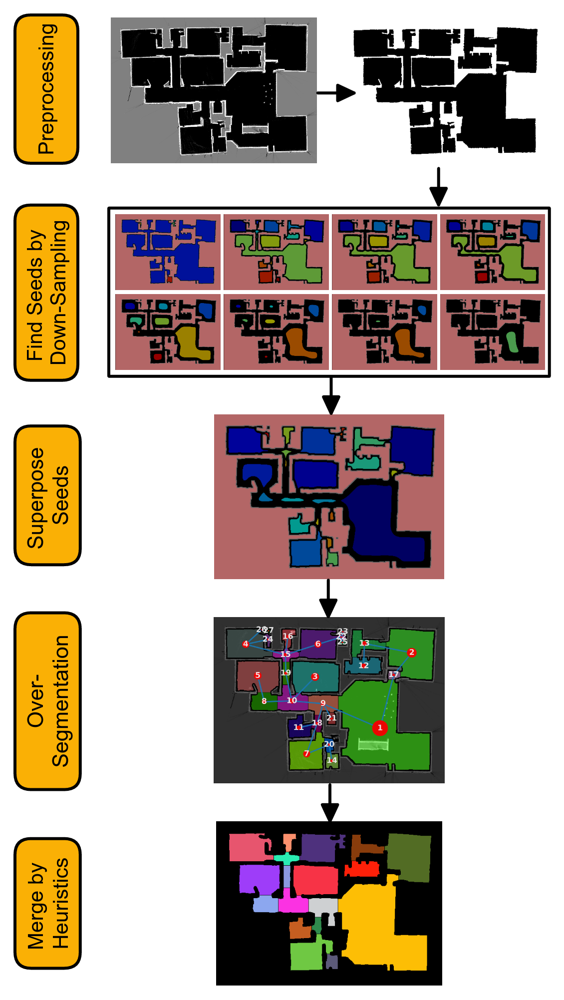

# Down-sampling-based 2D floor plan segmentation

This repository contains the Python implementation for the the paper [2D Floor Plan Segmentation Based on Down-sampling](https://arxiv.org/abs/2303.13798). This algorithm performs segmentation on a 2D floor plan by using a down-sampling technique. The overall pipeline is shown below. For more details please refer to the [paper](https://arxiv.org/abs/2303.13798).

<p align='center'>
  
</p>


## Detailed Comparisons with the state-of-the-art methods

Click on any of the following cases to view the comparison results with the three state-of-the-art methods introduced in [Bormann et al. (2016)](https://ieeexplore.ieee.org/document/7487234). From left to right the methods are: (1) ground truth labels, (2) morphologic segmentation, (3) distance-transform-based segmentation, (4) Voronoi-graph-based segmentation, and (5) our down-sampling-based segmentation.

<details><summary>With furniture</summary>
<p>
  
</p>
</details>

<details><summary>No furniture</summary>
<p>
  
</p>
</details>

## Usage

For quick testing of the package we recommend using Docker. We have tested the code on `Ubuntu 20.04`. First install the latest version of [docker](https://docs.docker.com/get-docker/). Then, follow the following instructions:

### Docker container usage

```bash
# Build the docker image
docker build --build-arg USERID=$(id -u) --build-arg GROUPID=$(id -g) -t py_floor_plan_segmenter .

# Running the container in interactive mode
docker run -u cloud -v .:/app -it py_floor_plan_segmenter bash

# Example command to perform segmentation on the rank.png image in the `/app/sandbox/maps/sample_1` folder.
python -m py_floor_plan_segmenter -i /app/sandbox/maps/sample_1 -p /app/sandbox/out
# Example command with debug flag to generate debugging images
python -m py_floor_plan_segmenter -i /app/sandbox/maps/sample_1 -p /app/sandbox/out --debug
# Example command with debug and animate flags to generate debugging images and animation
python -m py_floor_plan_segmenter -i /app/sandbox/maps/sample_1 -p /app/sandbox/out --debug --animate
```

<details><summary>Advanced usage: Running the API server</summary>
<p>
To run the API server:

```bash
# Clone the repository
git clone https://gitlab.tmecosys.net/mohammadreza.sharif/py_room_segmenter
cd py_room_segmenter

docker-compose build --build-arg USERID=$(id -u) --build-arg GROUPID=$(id -g)
# To start the server
docker-compose up -d
# To stop the server
docker-compose stop
```

Then, open your browser at the address for documentation: `http://0.0.0.0:8008/docs`
</p>
</details>


### Running the benchmarks and tests

In docker interactive mode:

```bash
cd /app

# Run benchmark furnished maps
./run_benchmark.sh sandbox/maps/benchmark/furnished

# Run benchmark maps with no furniture
./run_benchmark.sh sandbox/maps/benchmark/no_furniture

# Run Neato dataset present in the paper
./run_benchmark.sh sandbox/maps/neato/paper

# Run Neato extra dataset
./run_benchmark.sh sandbox/maps/neato/extra
```

### Evaluation of benchmarks

```bash
# Evaluate the furnished maps benchmark
./run_evaluation.sh sandbox/out/furnished sandbox/maps/benchmark/groundtruth

# Evaluate the no-furniture maps benchmark
./run_evaluation.sh sandbox/out/no_furniture sandbox/maps/benchmark/groundtruth
```

## Citation

Please use the following BibTeX entry for citing this work:

```bibtex
@ARTICLE{Sharif2023-bt,
  title         = "{2D} Floor Plan Segmentation Based on Down-sampling",
  author        = "Sharif, Mohammadreza and Mohan, Kiran and Suvarna, Sarath",
  month         =  mar,
  year          =  2023,
  archivePrefix = "arXiv",
  primaryClass  = "cs.CV",
  eprint        = "2303.13798"
}
```

